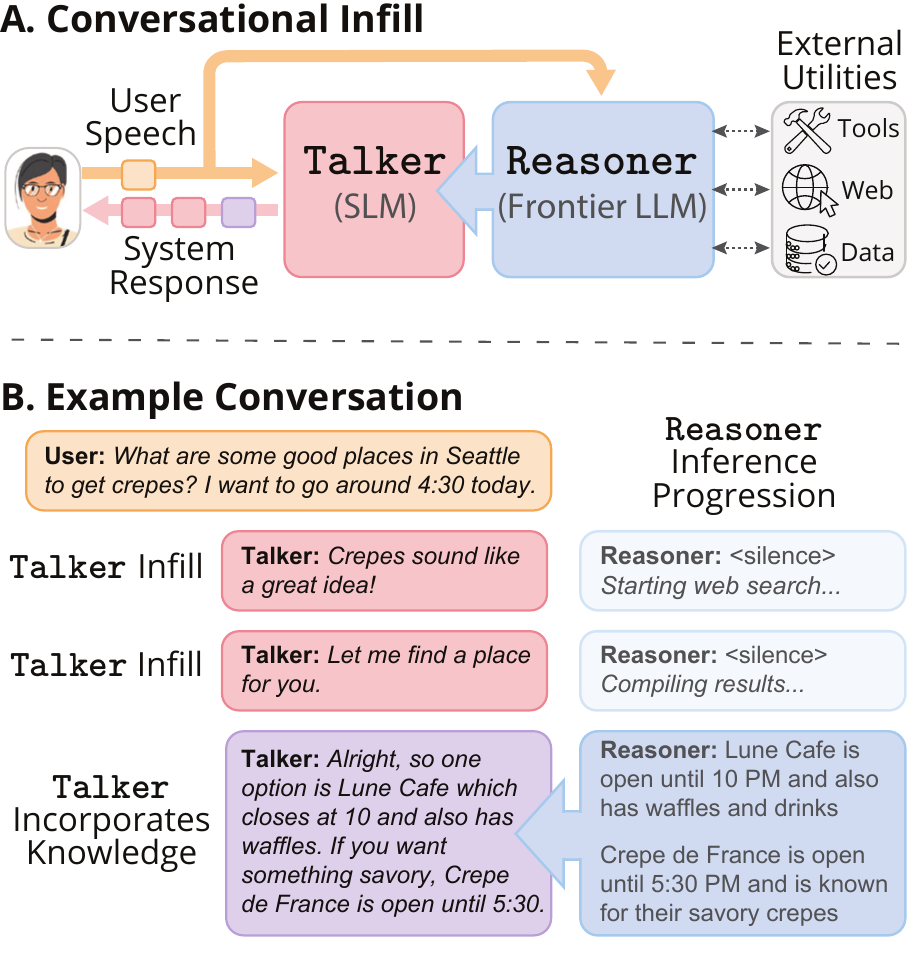

# ConvFill: Inference-Time Knowledge Transfer for Responsive and Intelligent Conversational Voice Agents

<p align="center">
  <a href="https://huggingface.co/datasets/zenglhardt/convfill-dataset"></a>&nbsp;
  <a href="https://arxiv.org/abs/2511.07397"></a>&nbsp;
  <a href="https://github.com/zenglhardt/convfill-dataset"></a>&nbsp;
  <a href="https://huggingface.co/collections/vysri/convfill-inference-time-knowledge-transfer"></a>
</p>

This repository contains the training and inference code for ConvFill a dual model collaboration system pairing a small, lightweight `Talker` model with a powerful cloud `Reasoner` model. During inference, the `Talker` has two roles. It consumes raw, inference-time information from the `Reasoner` *when available* and transforms it into fluent, contingent conversation and it produces fast, conversationally contingent filler phrases to hide `Reasoner` latency *when necessary*.


<p align="center">
  
</p>

# Overview


# Repository Contents
```
@misc{srinivas2026thinkingspeakinginferencetimeknowledge,
      title={Thinking While Speaking: Inference-Time Knowledge Transfer for Responsive and Intelligent Conversational Voice Agents}, 
      author={Vidya Srinivas and Zachary Englhardt and Shwetak Patel and Vikram Iyer},
      year={2026},
      eprint={2511.07397},
      archivePrefix={arXiv},
      primaryClass={cs.CL},
      url={https://arxiv.org/abs/2511.07397}, 
}
```

#### Frontend Precision Options

The web demo exposes a precision dropdown to toggle between two inference configurations:

| Precision | Backend | Format | Use Case |
|-----------|---------|--------|----------|
| **bf16** | HuggingFace (PyTorch) | Full precision with bfloat16 | Cross-platform (CPU/CUDA/MPS) |
| **int8** | MLX (Metal/Apple) | 8-bit quantized | macOS/Apple Silicon only; pre-quantized weights |

- When you select **bf16**, the demo loads `convfill_hf_pretrained_path` weights and runs inference via HuggingFace Transformers.
- When you select **int8**, the demo loads `convfill_hf_mlx_pretrained_path` weights and runs inference via MLX (Apple Silicon only).

Both precision options appear in the "Frontend precision" dropdown in the web demo menu. The active backend (HuggingFace or MLX) is displayed next to the precision selector.

# Python Environment Setup

Run the following commands from the root of the repository to get the necessary packages set up. ConvFill expects Python 3.11. Use either a Conda environment or a virtual environment. This environment works for both training and inference/demos.

```bash
# Option A: create and activate a Conda environment
conda create -n convfill python=3.11
conda activate convfill
```
OR
```bash
# Option B: create and activate a virtual environment
python3.11 -m venv .venv
source .venv/bin/activate
```
After creating/activating your environment, run:

```bash
python -m pip install -r requirements.txt
python -m pip install -e .
```

# Live Demo Instructions

## Dependencies
This web demo requires external APIs for `Reasoner` models and Node.js for the web frontend in addition to the Python environment described above. The final step for installing RAG and MCP features is optional.

### LLM API Keys
Make sure you have set API keys in your environment for whichever providers you'll use (Claude, OpenAI, or Gemini).
We recommend you use a secure method, such as those outlined in OpenAI's
[API key safety guidance](https://help.openai.com/en/articles/5112595-best-practices-for-api-key-safety).

To manually set the API key environment variables temporarily for your current shell session, see below:

```bash
export ANTHROPIC_API_KEY="your-anthropic-api-key"
export OPENAI_API_KEY="your-openai-api-key"
export GEMINI_API_KEY="your-gemini-api-key"
```
### Node Setup
The web demo frontend expects Node.js 24. If you use `nvm`, you can run the following from the repository root:

```bash
nvm install
nvm use
```
If you don't have NVM/Node.js installed, follow the [NVM download guide](https://www.nvmnode.com/guide/download.html),
then return here and run the `nvm install` / `nvm use` commands above. If you have a different Node setup, make sure
`node -v` shows `v24.x`. 

Then install the npm dependencies directly:

```bash
cd web_demo/frontend
npm ci
cd ../..
```

### FFMPEG
FFMPEG is required to handle audio files for speech transcription. Make sure you have it installed and added to your path. Installation instructions can be found here: [FFMPEG download and installation](https://www.ffmpeg.org/download.html).

### TTS Configuration (Non-macOS)
This step can be skipped if running macOS. The web demo uses text-to-speech (TTS) to synthesize audio responses. The demo defaults to using the built-in TTS engine in macOS. You can choose between TTS engines by editing the `tts_mode` field in `configs/demo_mode/*.json`: 

**Available TTS engines:**

| Engine | `tts_mode` | Setup | Notes |
|--------|-----------|-------|-------|
| macOS `say` | `"say"` | None | Uses native macOS voice synthesis. Audio plays on server; no PCM streamed to browser. Requires macOS. |
| Piper | `"piper"` | Place model files in `src/tts/voices/` | ONNX-based neural TTS. Streams PCM audio to browser. Works cross-platform. |

**To use Piper TTS (cross-platform):**

1. Download a Piper model (e.g., from [rhasspy.github.io/piper-samples](https://rhasspy.github.io/piper-samples/)). You need the `.onnx` file and its corresponding `.onnx.json` config.

2. Place the two files in the `src/tts/voices/` directory

3. Set `tts_mode` to `"piper"` in your config:
   ```json
   "tts_mode": "piper"
   ```

4. Restart the web demo for the change to take effect.

## Starting the Demo

You should now be able to launch the web demo by running the following from the project root: 

```bash
bash scripts/run_web_demo.sh 
```

This launches a frontend at: `http://127.0.0.1:5173` (open this in Google Chrome)


# Training a `Talker` Model

## Prepare the dataset
`dataset_gen/dataset_preprocess.py` converts a folder of raw conversations (from the synthetic data pipeline) into the single formatted JSONL file used to train the frontend models — the same format as the examples in `data`.

It reads **every file** in `--base_data_dir`, where each file is JSONL and each line is one conversation of the form `{"conversation": [turn, turn, ...]}`. Each turn holds the user message plus *lists* of paired thought/response phrases (the keys are configurable via the `--*_tag` flags). The script validates each turn (it skips conversations with missing fields, empty turns, or mismatched thought/response list lengths), unrolls every turn into its sequence of streaming phrases, and appends the formatted turns to a single output JSONL.

The easiest way to run it is the wrapper script `scripts/data_preprocess.sh`, which invokes `dataset_preprocess.py` with our standard arguments. Edit the input/output paths in that script to point at your own data, then run it from inside `scripts/` (its paths are relative):

```bash
cd scripts
bash data_preprocess.sh
```

The script is just the following call — set `--base_data_dir` to your folder of raw JSONL files and `--output_path` to where you want the formatted dataset:

```bash
python3 ../dataset_gen/dataset_preprocess.py \
  --user_tag user \
  --thoughts_tag thoughts \
  --responder_tag response \
  --base_data_dir <your raw data folder> \
  --output_path <your output .jsonl> \
  --include_history
```

Arguments:

| Flag | Meaning |
|------|---------|
| `--base_data_dir` | Folder whose files (each JSONL) are all read as input |
| `--output_path` | Output JSONL path (created/overwritten, then appended to) |
| `--user_tag` | Per-turn key holding the user message (we use `user`) |
| `--thoughts_tag` | Per-turn key holding the list of thought phrases (we use `thoughts`) |
| `--responder_tag` | Per-turn key holding the list of response phrases (we use `response`) |
| `--include_history` | When set, each phrase also carries the running text of the turn's previous responses |

## Model Fine-Tuning

`src/training/finetune_convfill.py` finetunes a HuggingFace model for the ConvFill task using a config from `configs/convfill_frontend_configs`. Run from the repo root:

```bash
python src/training/finetune_convfill.py \
  --config configs/convfill_frontend_configs/convfill_gemma3IT_270M_nd.json \
  --run_name my_experiment \
  --output_dir ./runs
```

| Flag | Required | Default | Meaning |
|------|----------|---------|---------|
| `--config` | yes | — | Path to a frontend training config JSON |
| `--run_name` | yes | — | Name for this run (used for logging/checkpoints) |
| `--output_dir` | no | `./runs` | Base directory for outputs |
| `--resume_from_scratch` | no | off | Ignore `latest.ckpt` and start fresh |

The easiest way to run it is the wrapper script `scripts/train_convfill.sh`:

```bash
bash scripts/train_convfill.sh
```

Multi-GPU training is handled automatically through Lightning's DDP when multiple GPUs are available, they will be auto-detected in the current configuration; CPU vs GPU is set by the `"platform"` field in the config.

## Supported Local Models

These are the configs in `configs/convfill_frontend_configs`, each pointing at a HuggingFace model. Pass one to `--config` when training, or reference it from `configs/demo_mode/convfill_overall_config.json` under the top-level `frontend_model_config_path` for inference.

| Config | HuggingFace model |
|--------|-------------------|
| `convfill_smollmIT_135M_nd.json` | `HuggingFaceTB/SmolLM2-135M-Instruct` |
| `convfill_smollmIT_360M_nd.json` | `HuggingFaceTB/SmolLM2-360M-Instruct` |
| `convfill_smollmIT_1.7B_nd.json` | `HuggingFaceTB/SmolLM2-1.7B-Instruct` |
| `convfill_gemma3IT_270M_nd.json` | `google/gemma-3-270m-it` |
| `convfill_gemma3IT_1B_nd.json` | `google/gemma-3-1b-it` |
| `convfill_llama3.2IT_1B_nd.json` | `meta-llama/Llama-3.2-1B-Instruct` |
| `convfill_qwen3_0.6B_nd.json` | `Qwen/Qwen3-0.6B` |

These are the models we have tested as ConvFill frontends, but they are not the only options — you can train any compatible HuggingFace model as a frontend using our training scripts and dataset (see [Training a Frontend Model](#training-a-frontend-model)).

# Details for Developers or Tinkerers

## Training Code Structure

* `configs` contains the model training and inference configurations for ConvFill frontend models
* `data` contains clean JSONL training data that is already formatted and can be used to train the frontend models
* `dataset` contains the torch Dataset and Collators used in frontend model training
* `dataset_gen` contains the data preprocessing script needed to take a folder of raw JSONL data generated by our synthetic data pipeline and convert it to a format like the example in `data`. You can use this to preprocess your own custom dataset
* `src/training` contains files to train the frontend models
* `src/training/convfill_pl_module.py` contains the code for a Lightning Module that is used to structure training and validation steps
* `src/training/finetune_convfill.py` contains the code to finetune an existing model for the ConvFill task. It supports logging through WandB and accepts configuration files of the form in `configs`. It has been tested for multi-GPU training and integrates DDP through Lightning's trainer.
* `src/training/metrics.py` contains metrics for logging. You can use this file to add your own scalar metric logging.

## Inference Code Structure

* `src/inference/convfill_stack` contains the full ConvFill stack — the small local ```Talker``` model running alongside a large ```Reasoner``` model.
* `src/inference/convfill_stack/run_convfill.py` defines the system configuration and core classes (`ConvFillConfig`, `ConvFillSystem`) used by the web demo.
* `src/inference/convfill_stack/convfill_backend_multi.py` drives the backend model across the `normal`, `rag`, and `mcp` task modes.
* `src/inference/shared` contains components shared across stacks — the conversation engine (`convfill_engine.py`), dialogue/turn state managers, and the MCP client (`mcp_client.py`).
* `src/inference/single_model_stack` contains library code for running a single model on its own — `large_model_only/` (cloud backend model) and `small_model_only/` (local frontend model). These are used by the engine; they are not run directly.
* `src/inference/rag` contains the retrieval module (`retreive.py`, exposing `RunRAG`) plus the committed FAISS index (`uw_phd.index`) and chunk store (`uw_chunks.json`) used in `rag` task mode.
* `web_demo` contains the browser demo: a FastAPI backend (`web_demo/backend`) and a React + Vite frontend (`web_demo/frontend`).


## Configs

* `configs/convfill_frontend_configs` — frontend (local) model training/inference configs, one per model size (see the table below).
* `configs/demo_mode` — unified runtime config for the demo: `convfill_overall_config.json`. Selects the frontend model, backend model, and prompt template for all task modes (normal, rag, mcp). Top-level fields apply to all modes; mode-specific fields (backend prompt, RAG/MCP config) are nested under `modes.<name>`.
* `configs/backend_model_configs` — available cloud model names per provider (`claude/`, `openai/`, `gemini/`).
* `configs/convfill_backend_prompts` — backend prompt templates for the ConvFill stack (the `*_conv.txt` files).
* `configs/backend_only_prompts` — prompt templates for backend-only single-model runs.


### Adding New Model(s)

Each frontend config file (e.g., `convfill_gemma3IT_270M_nd.json`) specifies the model, training hyperparameters, and inference weight paths. Model parameters for training and inference can be adjusted by editing these files. To add a new model, copy one of the existing configs and update the metadata to match the new model. 

The key fields for inference are:

| Field | Description |
|-------|-------------|
| `model_name` | HuggingFace model ID (used for downloading base weights) |
| `backend` | Inference backend: `"hf"` (HuggingFace/PyTorch) or `"mlx"` (MLX/Apple Silicon) |
| `convfill_hf_pretrained_path` | HuggingFace model ID or local path to ConvFill-trained weights for HuggingFace backend (bf16 precision) |
| `convfill_hf_mlx_pretrained_path` | HuggingFace model ID or local path to ConvFill-trained weights for MLX backend (int8 quantized) |

The weight paths can be either HuggingFace model IDs (e.g., `"vysri/gemma3-270m-IT-ConvFill"`) or local filesystem paths (e.g., `"/path/to/local/weights"`).

## Advanced Demo Setup

The default `normal` task mode needs no extra setup. The `rag` and `mcp` modes each require a one-time setup before you can run them in the web demo. 

### RAG mode

RAG mode retrieves context from a vector index before each backend response. At query time it embeds the user's turn with OpenAI's `text-embedding-3-large`, so it **requires an OpenAI API key** — even if your backend model is Claude or Gemini.

1. Export `OPENAI_API_KEY` in your environment (see [Quick Setup](#quick-setup)).
2. The retrieval assets are already committed — `src/inference/rag/uw_phd.index` (FAISS index) and `src/inference/rag/uw_chunks.json` (chunk store) — and the local reranker (`cross-encoder/ms-marco-MiniLM-L-6-v2`) downloads automatically on first use. You can select RAG mode in the web demo UI.

### MCP mode

MCP mode lets the backend model call tools exposed by external [Model Context Protocol](https://modelcontextprotocol.io) servers. Those servers are **separate external repos** that you download and run yourself, then wire into `configs/demo_mode/convfill_overall_config.json` under `modes.mcp.task_specific_config`.

The default config wires up the [`mail-mcp`](https://github.com/tecnologicachile/mail-mcp) email server (**v0.4.5**, vendored under `external/mail-mcp`). We ran it via Docker in our examples:

```jsonxw
"mcp_servers": [
  {
    "name": "mail",
    "transport": "stdio",
    "command": "docker",
    "args": ["exec", "-i", "gmail-mcp", "mail-mcp"],
    "env": {}
  }
]
```

To use it, follow the setup instructions in [`mail-mcp` v0.4.5](https://github.com/tecnologicachile/mail-mcp) (pick whichever method you prefer — Docker, native binary, etc.), then update `command` and `args` in the config to match how you launch it.

To add other MCP servers, download them and add an entry to the `mcp_servers` list with the appropriate `command`, `args`, and `env`. `max_tool_iterations` caps how many tool calls the backend may chain per turn. You can select MCP mode in the web demo UI.

### Customizing Backend API Models

Set the backend model via `backend_model_name` / `backend_model_mode` in `configs/demo_mode/convfill_overall_config.json` (top-level fields). Available names per provider (`configs/backend_model_configs/<provider>/model_names.json`):

| Provider (`backend_model_mode`) | Model names |
|---------------------------------|-------------|
| `claude` | `claude-haiku-4-5-20251001`, `claude-opus-4-7`, `claude-sonnet-4-6` |
| `openai` | `gpt-4o`, `gpt-4-turbo`, `gpt-5.5`, `gpt-5.4`, `gpt-5.4-mini`, `gpt5.4-nano` |
| `gemini` | `gemini-2.5-flash`, `gemini-2.5-flash-lite`, `gemini-3-flash-preview`, `gemini-3.1-flash-lite-preview`, `gemini-3.1-pro-preview` |

### Launching Full Configuration

```bash
bash scripts/run_web_demo.sh [config_path]
```

Where `config_path` is optional and defaults to `configs/demo_mode/convfill_simple_config.json`. Examples:

```bash
bash scripts/run_web_demo.sh                                            
# uses default config like in the simple mode above
bash scripts/run_web_demo.sh configs/demo_mode/convfill_full_config.json 
# uses full config used in paper with MCP/RAG set up here in this section
```

This launches:
- FastAPI backend: `http://127.0.0.1:8000`
- Vite frontend: `http://127.0.0.1:5173` (open this in Google Chrome)
